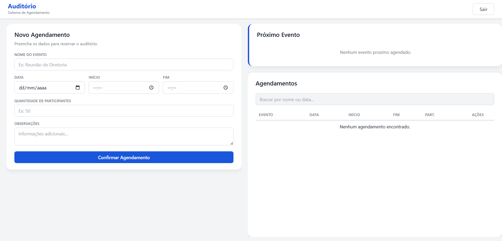
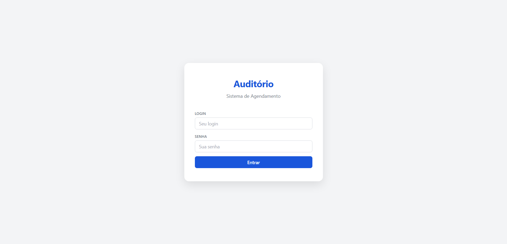

# Sistema de Agendamento do Auditório

Sistema web full-stack para gerenciamento de reservas de auditório corporativo, com autenticação JWT, detecção de conflitos de horário e interface responsiva.




## Funcionalidades

- **Autenticação segura** — login com JWT e senhas hasheadas com bcrypt
- **Cadastro e edição de eventos** — nome, data, horário, participantes e observações
- **Detecção de conflitos** — impede sobreposição de horários no mesmo dia
- **Card de próximo evento** — destaque visual do evento mais próximo
- **Busca textual** — filtra agendamentos por nome ou data
- **CRUD completo** — criar, listar, editar e excluir agendamentos
- **Permissões por usuário** — cada usuário edita/exclui apenas seus próprios eventos
- **Health check** — endpoint de monitoramento da API e banco de dados

## Stack

| Camada | Tecnologia |
|--------|------------|
| Backend | Python 3, FastAPI |
| Frontend | HTML5, CSS3, JavaScript (vanilla) |
| Banco | PostgreSQL |
| ORM | SQLAlchemy 2.0 |
| Migrações | Alembic |
| Autenticação | JWT + bcrypt (passlib) |
| Validação | Pydantic v2 |
| Containerização | Docker, docker compose |
| Proxy reverso | Nginx |

## Arquitetura

```
cliente (browser)  →  FastAPI (REST)  →  Service  →  Repository  →  PostgreSQL
                         ↑
                   JWT Auth (security.py)
```

O backend segue o padrão **Repository-Service**, separando acesso a dados, regras de negócio e rotas HTTP:

- `models.py` — definição das tabelas (SQLAlchemy ORM)
- `schemas.py` — validação de entrada/saída (Pydantic)
- `repository.py` — queries e acesso ao banco
- `service.py` — lógica de negócio e validações
- `routers/` — endpoints REST
- `security.py` — hash de senha, criação e validação de tokens JWT

## Estrutura do Projeto

```
.
├── docker-compose.yml          # Orquestração dos containers
├── .env.docker                 # Variáveis de ambiente Docker
├── auditorio-front/            # Frontend (SPA vanilla)
│   ├── Dockerfile              # Container nginx
│   ├── nginx.conf              # Proxy reverso p/ API
│   ├── index.html
│   ├── app.js
│   └── styles.css
├── projeto-auditorio/          # Backend FastAPI
│   ├── Dockerfile              # Container Python/FastAPI
│   ├── .dockerignore
│   ├── app/
│   │   ├── main.py            # Entry point, CORS, routers
│   │   ├── database.py        # Conexão SQLAlchemy
│   │   ├── models.py          # Tabelas: usuarios, agendamentos
│   │   ├── schemas.py         # Schemas Pydantic
│   │   ├── repository.py      # Camada de dados
│   │   ├── service.py         # Regras de negócio
│   │   ├── security.py        # JWT + bcrypt
│   │   ├── dependencies.py    # Injeção de dependências
│   │   ├── tests.py           # Testes com pytest
│   │   └── routers/
│   │       ├── auth.py        # /auth/login, /auth/cadastro
│   │       └── agendamentos.py # CRUD de agendamentos
│   ├── alembic/               # Migrações
│   ├── .env.example
│   └── requirements.txt
└── README.md
```

## API Endpoints

| Método | Rota | Descrição | Auth |
|--------|------|-----------|------|
| `POST` | `/auth/login` | Login e obtenção de token | Não |
| `POST` | `/auth/cadastro` | Cadastro de novo usuário | Não |
| `GET` | `/agendamentos` | Listar todos os agendamentos | Sim |
| `GET` | `/agendamentos/proximo` | Próximo evento agendado | Sim |
| `POST` | `/agendamentos/criar_agendamento` | Criar agendamento | Sim |
| `PUT` | `/agendamentos/{id}` | Atualizar agendamento | Sim |
| `DELETE` | `/agendamentos/{id}` | Excluir agendamento | Sim |
| `GET` | `/health` | Health check | Não |

## Como Rodar

### Pré-requisitos

- Python 3.10+
- PostgreSQL 14+
- Virtual environment (recomendado)

### 1. Clone o repositório

```bash
git clone https://github.com/seu-usuario/sistema-controle-auditorio.git
cd sistema-controle-auditorio
```

### 2. Backend

```bash
cd projeto-auditorio

# Criar e ativar ambiente virtual
python -m venv .venv
# Windows:
.venv\Scripts\activate
# Linux/Mac:
source .venv/bin/activate

# Instalar dependências
pip install -r requirements.txt

# Configurar variáveis de ambiente
cp .env.example .env
# Edite .env com suas credenciais do PostgreSQL

# Rodar migrações
alembic upgrade head

# Iniciar servidor
uvicorn app.main:app --reload --host 0.0.0.0 --port 8000
```

### 3. Frontend

Abra `auditorio-front/index.html` diretamente no navegador ou sirva com qualquer servidor HTTP:

```bash
cd auditorio-front
python -m http.server 5500
```

Acesse `http://localhost:5500`.

### 4. Criar usuário

Use o endpoint de cadastro ou a documentação interativa do FastAPI em `http://localhost:8000/docs`.

## Docker

Suba toda a stack com um comando:

```bash
# Configure as variaveis de ambiente (edite o arquivo com suas credenciais)
copy .env.docker .env
# Edite .env com sua DATABASE_URL e SECRET_KEY

# Build e sobe os containers
docker compose up -d --build
```

Acesse `http://localhost` (porta 80).

### Servicos

| Servico | Porta | Descricao |
|---------|-------|-----------|
| `frontend` | 80 | Nginx servindo SPA + reverse proxy para API |
| `api` | 8000 | FastAPI (tambem exposta para debug) |

> O banco de dados e externo (Neon PostgreSQL). Configure a `DATABASE_URL` no `.env`.

### Comandos uteis

```bash
# Ver logs
docker compose logs -f api

# Rodar migracoes manualmente (o entrypoint ja faz automaticamente)
docker compose exec api alembic upgrade head

# Parar tudo
docker compose down

# Recriar do zero
docker compose down && docker compose up -d --build
```

## Deploy no Render

O `Dockerfile` na raiz do projeto esta pronto para deploy no [Render](https://render.com).

### Configuracao

1. Crie um **PostgreSQL** no Render (New → PostgreSQL)
2. Crie um **Web Service** no Render (New → Web Service)
3. Conecte ao repositorio do GitHub
4. Configure o Web Service:

| Campo | Valor |
|-------|-------|
| Runtime | Docker |
| Dockerfile Path | `Dockerfile` |

5. Adicione as variaveis de ambiente (Environment → Environment Variables):

| Variavel | Valor |
|----------|-------|
| `DATABASE_URL` | String de conexao interna do PostgreSQL do Render |
| `SECRET_KEY` | Chave secreta para JWT |

> O Render define `PORT` e a `DATABASE_URL` interna automaticamente se vinculados. Para usar o valor interno, copie a string da aba **Connections** do banco PostgreSQL.

6. Clique em **Create Web Service**

### Health Check

Configure o health check path como `/health`. O endpoint verifica a conexao com o banco.

## Testes

```bash
cd projeto-auditorio
pytest app/tests.py -v
```

## Banco de Dados

### Diagrama

```
usuarios
├── id (UUID, PK)
├── nome (VARCHAR 100)
├── login (VARCHAR 50, UNIQUE)
└── senha_hash (VARCHAR 255)

agendamentos
├── id (UUID, PK)
├── nome_evento (VARCHAR 150)
├── data_evento (DATE)
├── hora_inicio (TIME)
├── hora_fim (TIME)
├── quantidade_participantes (INTEGER)
├── observacoes (TEXT)
└── usuario_id (UUID, FK → usuarios.id)
```

### Migrações

```bash
# Verificar status
alembic current

# Gerar nova migração após alterar models.py
alembic revision --autogenerate -m "descricao da alteracao"

# Aplicar migrações
alembic upgrade head
```

## Regras de Negócio

- Hora de início deve ser menor que hora de término
- Não permite sobreposição de horários no mesmo dia
- Apenas o criador do evento pode editá-lo ou excluí-lo

---

Desenvolvido por [Eduardo Nunes](https://linkedin.com/in/eduardonunesfvm)
