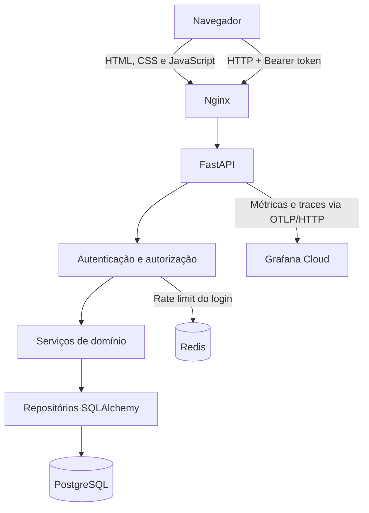
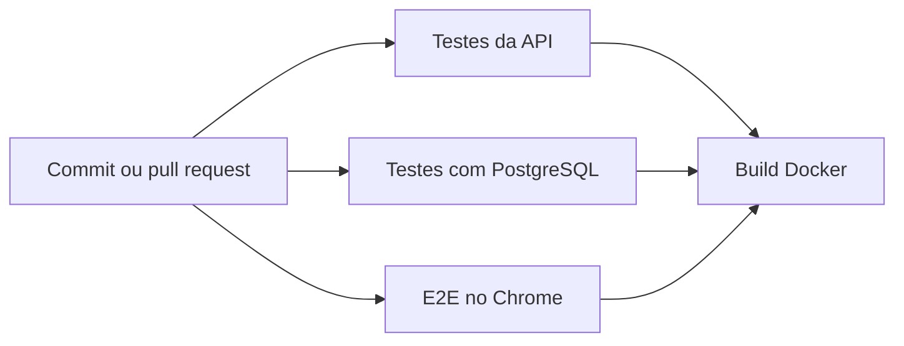

# Arquitetura e decisões técnicas

Este documento apresenta as partes do sistema que não ficam evidentes apenas pela interface. O objetivo é registrar como as regras de negócio, a concorrência e os limites de responsabilidade foram tratados.

## Visão geral



### Frontend

O frontend é uma aplicação em HTML, CSS e JavaScript sem framework. O fluxo de criação e edição usa um wizard com três etapas:

1. escolha da data e consulta da disponibilidade;
2. escolha de início e fim a partir das opções válidas;
3. dados do evento e confirmação.

As requisições de disponibilidade possuem cancelamento e identificação. Assim, uma resposta lenta para uma data anterior não substitui o estado da data mais recente. A interface também preserva os dados do formulário quando a API detecta um conflito após a confirmação.

### API

As responsabilidades do backend estão separadas em:

- `routers`: contrato HTTP, status codes e dependências;
- `dependencies`: autenticação do token e autorização por perfil;
- `service`: regras de negócio e tradução de conflitos para respostas da API;
- `repository`: consultas e persistência com SQLAlchemy;
- `models` e `schemas`: modelos persistidos e contratos de entrada e saída.

Essa separação mantém os endpoints pequenos e permite testar as regras sem acoplá-las à interface.

## Consistência dos agendamentos

O sistema considera os intervalos como semiabertos: `[início, fim)`. Por isso, um evento pode terminar exatamente quando o próximo começa.

Uma reserva é aceita somente quando:

- o horário final é posterior ao inicial;
- o intervalo está inteiramente entre 07:00 e 11:00 ou entre 13:00 e 20:00;
- não existe outro agendamento sobreposto na mesma data.

### Defesa em profundidade

A API consulta conflitos antes de gravar para oferecer uma resposta compreensível ao usuário. Essa verificação isolada, porém, não seria suficiente:

```text
Requisição A consulta ─┐
                      ├─ ambas encontram o horário livre ─ ambas tentam gravar
Requisição B consulta ┘
```

Para proteger o dado nesse cenário, o PostgreSQL mantém três constraints:

- `CHECK` garantindo que o fim seja posterior ao início;
- `CHECK` garantindo que o evento permaneça dentro de um turno;
- `EXCLUDE USING gist` impedindo a interseção de intervalos na mesma data.

Se duas transações concorrentes tentarem reservar o mesmo período, apenas uma é persistida. A outra é convertida pela aplicação em HTTP `409` com o código estável `schedule_conflict`.

Antes de criar essas constraints, a migration bloqueia a tabela e procura registros históricos inválidos ou sobrepostos. Se encontrar algum, ela informa os identificadores e interrompe o upgrade sem alterar os dados.

## Autenticação e autorização

As senhas são armazenadas como hash e a autenticação emite um JWT usado como Bearer token. O usuário é carregado do banco a cada requisição autenticada; a autorização não depende apenas do perfil contido no token.

| Perfil | Consultar | Criar | Alterar ou excluir |
|---|---:|---:|---:|
| `visualizador` | Sim | Não | Não |
| `superintendente` | Sim | Sim | Apenas os próprios eventos |
| `admin` | Sim | Sim | Apenas os próprios eventos |

O endpoint de login pode aplicar dois limites simultâneos no Redis: por endereço IP e por login normalizado. Um script Lua verifica e incrementa os contadores atomicamente. O login é representado nas chaves apenas por seu hash SHA-256.

Se o Redis estiver indisponível, o sistema adota *fail-open*: registra o erro e mantém a autenticação disponível. Essa é uma escolha de disponibilidade que exige monitoramento dos logs em produção.

## Disponibilidade

`GET /agendamentos/disponibilidade` retorna um contrato orientado à interface, contendo:

- fuso horário da agenda;
- início e fim da jornada;
- bloqueios, como a pausa de almoço;
- períodos já ocupados, ordenados por horário.

Na edição, o próprio agendamento pode ser excluído da consulta. Essa operação só é permitida ao autor e não fica disponível para o perfil de visualização.

## Pipeline de entrega



Após o CI, `develop` é publicado no ambiente isolado de homologação e `master` em produção. PostgreSQL, Redis e segredos não são compartilhados entre esses ambientes. Consulte o [guia de ambientes](environments.md).

Os testes com PostgreSQL exercitam a migration e duas gravações concorrentes. Os testes E2E cobrem o wizard, a linha do tempo, erros de disponibilidade, acessibilidade por teclado, diferentes viewports e persistência do tema.

## Observabilidade

O OpenTelemetry instrumenta o FastAPI e o SQLAlchemy e exporta métricas e traces em lote diretamente para o Grafana Cloud. A aplicação não depende do backend de observabilidade: configuração ausente ou falha de exportação não impede o atendimento das requisições.

As métricas de domínio são counters sem atributos dinâmicos, evitando séries por usuário, evento ou reserva. Redis não é instrumentado automaticamente porque suas chaves de rate limit contêm IP ou hash do login. `/health` e arquivos estáticos são excluídos para reduzir ruído; a disponibilidade do `/health` é verificada externamente pelo Synthetic Monitoring.

Os logs permanecem no Railway nesta etapa. Consulte o [guia de observabilidade](observability.md) para configuração, dashboard, alertas e políticas de privacidade.

## Trade-offs atuais

- O frontend sem framework reduz dependências e custo de build, mas exige disciplina manual para gerenciar estado e componentes.
- O rate limiting em modo *fail-open* preserva o login em uma falha do Redis, mas reduz temporariamente a proteção contra força bruta.
- A API diferencia leitura e edição por perfil; administradores ainda não possuem uma política especial para alterar eventos de terceiros.
- O cadastro de usuários está público no contrato atual e deve ser restringido antes de expor a aplicação fora de um ambiente controlado.
