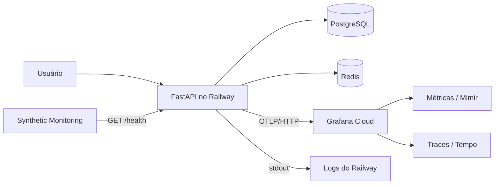

# Observabilidade com Grafana Cloud

O backend envia métricas e traces diretamente ao endpoint OTLP/HTTP do Grafana Cloud. Os logs continuam no `stdout` da aplicação e são consultados no Railway. Não há Prometheus, Loki, Grafana ou collector hospedado no projeto.



## O que é coletado

A instrumentação automática registra:

- duração, método, rota normalizada e status das requisições HTTP;
- spans das operações SQLAlchemy, mantendo os valores dos parâmetros separados da instrução SQL;
- exceções e relações entre a requisição HTTP e o acesso ao banco.

As métricas de negócio são counters sem atributos dinâmicos:

| Métrica OpenTelemetry | Nome no Grafana Cloud | Significado |
|---|---|---|
| `auditorio.reservations.created` | `auditorio_reservations_created_total` | Reservas confirmadas |
| `auditorio.reservations.updated` | `auditorio_reservations_updated_total` | Reservas alteradas |
| `auditorio.reservations.deleted` | `auditorio_reservations_deleted_total` | Reservas excluídas |
| `auditorio.scheduling.conflicts` | `auditorio_scheduling_conflicts_total` | Conflitos rejeitados |
| `auditorio.scheduling.invalid_window` | `auditorio_scheduling_invalid_window_total` | Horários fora da política |
| `auditorio.auth.rate_limited` | `auditorio_auth_rate_limited_total` | Tentativas bloqueadas |
| `auditorio.auth.rate_limiter_fail_open` | `auditorio_auth_rate_limiter_fail_open_total` | Falhas do Redis que liberaram o login |

O Grafana converte pontos e hifens para `_` e adiciona `_total` aos counters monotônicos recebidos via OTLP.

## Privacidade e cardinalidade

A configuração não captura corpos, headers HTTP, tokens JWT, cookies, logins, nomes de eventos, IDs de usuários ou valores associados aos parâmetros SQL. `/health` e arquivos estáticos são excluídos dos traces.

O Redis não recebe instrumentação automática: as chaves do rate limiter contêm o endereço IP ou o hash do login e não devem aparecer em spans. Em vez disso, apenas os counters agregados de bloqueio e *fail-open* são enviados.

## 1. Criar e conectar a stack

1. Crie uma conta gratuita em [Grafana Cloud](https://grafana.com/products/cloud/).
2. Abra a stack e acesse **Connections > Add new connection > OpenTelemetry**.
3. Selecione a configuração para enviar OTLP diretamente da aplicação.
4. Gere um Cloud Access Policy token com permissão para escrever métricas e traces.
5. Copie da própria tela os valores de endpoint e autenticação. Para Python, preserve a codificação fornecida pelo Grafana, inclusive `Basic%20` quando presente.

Não grave o token em `.env.example`, arquivos do dashboard, logs, issues ou commits.

## 2. Configurar o Railway

Adicione estas variáveis ao serviço da aplicação:

```dotenv
OTEL_ENABLED=true
OTEL_EXPORTER_OTLP_ENDPOINT=https://otlp-gateway-REGIAO.grafana.net/otlp
OTEL_EXPORTER_OTLP_HEADERS=Authorization=Basic%20CREDENCIAL_GERADA_PELO_GRAFANA
OTEL_EXPORTER_OTLP_PROTOCOL=http/protobuf
OTEL_SERVICE_NAME=auditorio-api
OTEL_RESOURCE_ATTRIBUTES=service.namespace=auditorio,deployment.environment.name=production
OTEL_TRACES_SAMPLER=parentbased_traceidratio
OTEL_TRACES_SAMPLER_ARG=1.0
OTEL_METRIC_EXPORT_INTERVAL=60000
OTEL_SEMCONV_STABILITY_OPT_IN=http
```

`OTEL_ENABLED` fica desativado por padrão no repositório. Se o endpoint ou os headers estiverem ausentes, a aplicação registra o erro e inicia sem telemetria. Falhas posteriores de exportação são tratadas pelo SDK em segundo plano e não interrompem requisições.

O backend também inclui automaticamente estes metadados quando fornecidos pelo Railway:

- `RAILWAY_ENVIRONMENT_NAME` como `deployment.environment.name`;
- `RAILWAY_REPLICA_ID` como `service.instance.id`;
- `RAILWAY_GIT_COMMIT_SHA` como `service.version`;
- IDs do deployment e do serviço como atributos `railway.*`.

Após salvar as variáveis, faça um novo deploy.

## 3. Confirmar a ingestão

1. Acesse a aplicação e execute login, consulta e criação de uma reserva de teste.
2. Aguarde até dois minutos, pois as métricas são exportadas em lotes de 60 segundos.
3. No Grafana, abra **Explore > Metrics** e consulte:

```promql
auditorio_reservations_created_total
```

4. Em **Explore > Traces**, use:

```traceql
{ resource.service.name = "auditorio-api" }
```

5. Confirme que os recursos possuem ambiente, versão e instância, e que não existem credenciais nos atributos.

Se nenhuma telemetria chegar, verifique os logs do Railway por `OpenTelemetry desativado` ou erros do exporter, sem copiar o valor de `OTEL_EXPORTER_OTLP_HEADERS` para o diagnóstico.

## 4. Importar o dashboard

1. No Grafana, acesse **Dashboards > New > Import**.
2. Envie [`grafana-dashboard.json`](grafana-dashboard.json).
3. Associe `DS_PROMETHEUS` ao data source de métricas da stack.
4. Associe `DS_TEMPO` ao data source de traces.
5. Selecione o job que termina em `auditorio-api` e o ambiente `production`.

O dashboard contém tráfego e latência HTTP, erros 5xx, endpoints lentos, operações de reserva, rejeições de agenda, proteção do login, traces com erro e spans SQL acima de 100 ms.

## 5. Configurar o monitor sintético

No Grafana Cloud Synthetic Monitoring:

1. crie um check HTTP chamado `auditorio-health-production`;
2. use `GET https://DOMINIO-DA-APLICACAO/health`;
3. configure frequência de 60 segundos;
4. exija status HTTP `200`;
5. adicione uma asserção de corpo contendo `"status":"healthy"`;
6. escolha uma probe pública próxima da região do Railway;
7. salve e confirme que `probe_success` passa a valer `1`.

O `/health` consulta o PostgreSQL. Portanto, o check detecta tanto indisponibilidade da aplicação quanto perda da conexão principal com o banco.

## 6. Contact point e alertas

Crie um contact point de e-mail em **Alerts & IRM > Alerting > Contact points** e envie uma notificação de teste antes de associá-lo às regras.

Use o job e o ambiente escolhidos no dashboard para criar as regras abaixo.

### Aplicação ou banco indisponível por dois minutos

```promql
max_over_time(probe_success{job="auditorio-health-production"}[2m]) == 0
```

Avaliar a cada minuto, sem período adicional de espera.

### Três respostas 5xx em cinco minutos

```promql
sum(increase(http_server_request_duration_seconds_count{
  job=~".*auditorio-api",
  deployment_environment_name="production",
  http_response_status_code=~"5.."
}[5m])) >= 3
```

### p95 acima de 1,5 segundo com tráfego suficiente

```promql
(
  histogram_quantile(
    0.95,
    sum by (le) (
      rate(http_server_request_duration_seconds_bucket{
        job=~".*auditorio-api",
        deployment_environment_name="production"
      }[10m])
    )
  ) > 1.5
)
and
(
  sum(increase(http_server_request_duration_seconds_count{
    job=~".*auditorio-api",
    deployment_environment_name="production"
  }[10m])) >= 20
)
```

Avaliar a cada minuto e manter pendente por dez minutos antes de alertar.

### Rate limiter em *fail-open*

```promql
sum(increase(auditorio_auth_rate_limiter_fail_open_total{
  job=~".*auditorio-api",
  deployment_environment_name="production"
}[5m])) >= 1
```

### Cinco bloqueios de login em cinco minutos

```promql
sum(increase(auditorio_auth_rate_limited_total{
  job=~".*auditorio-api",
  deployment_environment_name="production"
}[5m])) >= 5
```

Conflitos de agenda são indicadores de produto e não devem alertar: eles podem representar duas pessoas escolhendo legitimamente o mesmo período.

## 7. Validar os alertas

- Confirme primeiro a entrega pelo botão de teste do contact point.
- Para o alerta de rate limit, use somente uma conta e um ambiente de teste; não faça tentativas automatizadas contra usuários reais.
- Para testar indisponibilidade sem afetar produção, crie temporariamente um segundo synthetic check apontando para um caminho inexistente e associe a regra a esse job.
- Não provoque falhas no PostgreSQL ou Redis de produção apenas para testar alertas.
- Depois da validação, registre no README uma captura do dashboard com domínio, e-mail e identificadores sensíveis ocultos.

## Operação e custo

Amostragem de traces está em 100% para manter métricas RED coerentes no baixo volume atual. Se o volume crescer, revise amostragem, retenção e cardinalidade antes de reduzir o percentual, pois métricas geradas a partir de spans deixam de representar todo o tráfego quando há amostragem.

Monitore o painel de uso do Grafana Cloud e mantenha limites de custo no Railway. A arquitetura não cria serviços adicionais; o consumo extra no Railway vem do pequeno overhead do SDK e do egress dos lotes OTLP.
